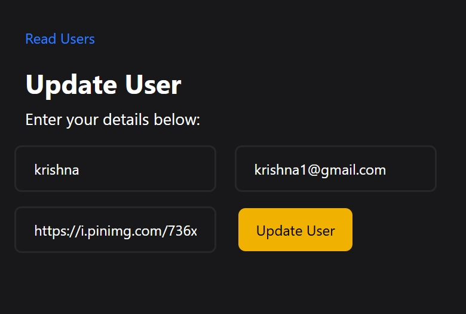

# CRUD Mongodb App 

This is a CRUD (Create, Read, Update, Delete) weather application built with Nodejs,ExpressJs, Ejs and MOngodb . The app allows users to add, view, update, and delete username, email and profile .

##  Table of Contents

-  [Technologies-Used](#technologies-used)

-  [Installation](#installation)

-  [License](#license)

-  [Screenshots](#screenshot)

  

##  Technologies-Used

  

- NodeJs

- ExpressJs

- Ejs

- Mongodb

- Tailwindcss

  

  

##  Installation

  

Step-by-step instructions to set up the project locally:

1. Clone the repository:

        git clone https://github.com/Roshan-Metrix/CRUD_Mongodb.git

  
2. Navigate to the project directory:

       cd CRUD_Mongodb

3. Install dependencies

       npm install  

4. Run App

       node run app.js

  
## License

This project is licensed under the [MIT License](license.txt).

## Screenshot

